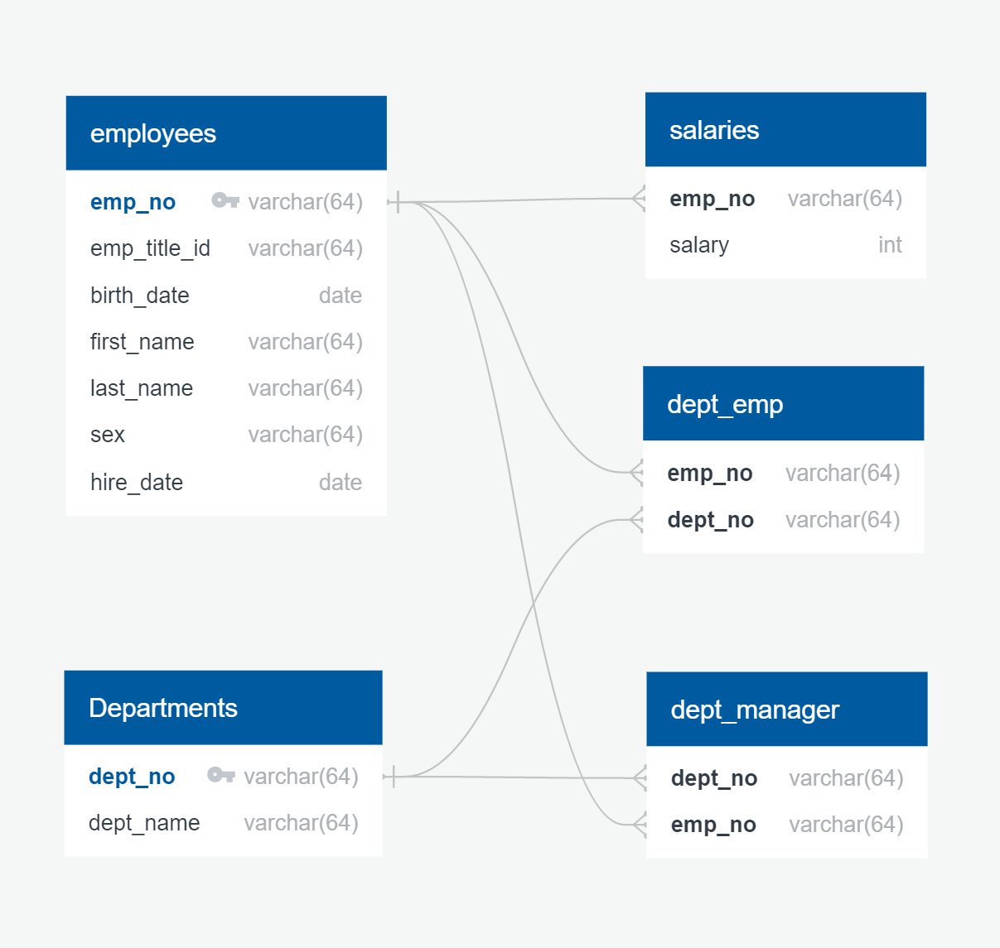

# SQL CHALLENGE
This project deals with table creation and queries within a database involving **PostgreSQL** and **PGadmin**

## Requirements
 Your first major task is a research project on employees of the corporation from the 1980s and 1990s. All that remain of the database of employees from that period are six CSV files.

In this assignment, you will design the tables to hold data in the CSVs, import the CSVs into a SQL database, and answer questions about the data. In other words, you will perform:

- Data Engineering
- Data Analysis

The folder *EmployeeSQL* contains the six .csv files that were utilized. In order to elucidate the relationships between the files, the following ERD was created, making sure to specify data types, primary keys, and foreign keys.

## Table Creation
Now that the relationships between the tables were understood, the tables were created and then data was imported into them using SQL within PGAdmin. 
I was sure to import the data in the correct order in which I created my tables. In a few situations, I was forced to make a compound key to designate uniqueness because the table was made up of two foreign keys. 

The SQL code used to create the tables is in the file **tableschemata.sql**.

## Queries
Once the database was complete, the following questions were investigated:

1. List the following details of each employee: employee number, last name, first name, sex, and salary.

2. List first name, last name, and hire date for employees who were hired in 1986.

3. List the manager of each department with the following information: department number, department name, the manager's employee number, last name, first name.

4. List the department of each employee with the following information: employee number, last name, first name, and department name.

5. List first name, last name, and sex for employees whose first name is "Hercules" and last names begin with "B."

6. List all employees in the Sales department, including their employee number, last name, first name, and department name.

7. List all employees in the Sales and Development departments, including their employee number, last name, first name, and department name.

8. In descending order, list the frequency count of employee last names, i.e., how many employees share each last name.

The code used to make these queries is in the file **quries.sql**

